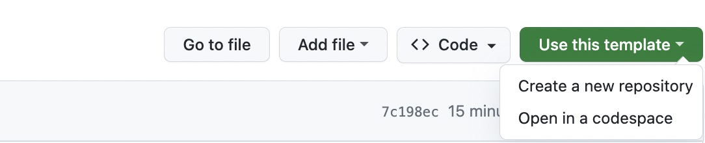
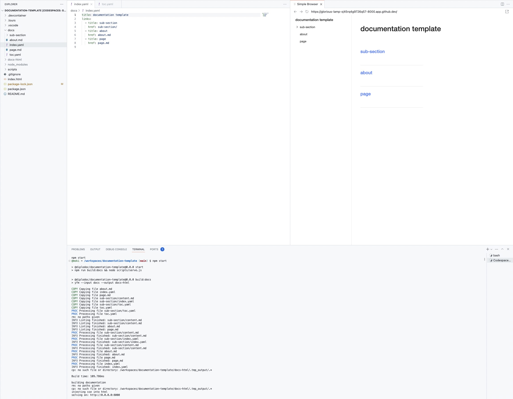

# Documentation Template created by Diplodoc

Features:

- initial project structure
- dev server with hot reload
- codespaces support
- vscode tutorial via code tours
- **automated PDF generation and publication** 📄

## Initial project structure

Initiatl project structure with basic content can be found within your public github repo "diplodoc-example/docs" 

## Usage

### Run locally by cloning repo:

```
> git clone git@github.com:diplodoc-platform/documentation-template.git

> cd documentation-template

> npm start

> listening on 0.0.0.0:8000

```
now you have development server with hot reload runing and serving built documentation on `0.0.0.0:8000`

### github codespaces

press Use this template -> Open in a codespace



wait for the development server startup

enjoy developing documentation with html result preview in split view



## PDF Generation 📄

This documentation template now includes **automated PDF generation and publication** using GitHub Actions!

### What you get:
- **Professional PDFs** with proper formatting, headers, and page numbers
- **Multi-language support** (English & Russian)
- **Automatic publication** to GitHub Pages
- **Release integration** - PDFs attached to releases
- **Multiple access methods** - artifacts, GitHub Pages, and releases

### Quick Start:
1. **Enable GitHub Pages**: Go to Settings → Pages → Deploy from `gh-pages` branch
2. **Trigger generation**: Push changes to `docs/**` or run workflow manually
3. **Access PDFs**: 
   - **GitHub Pages**: `https://[username].github.io/[repo-name]/pdf/`
   - **Artifacts**: Download from Actions tab
   - **Releases**: Automatically attached as assets

### Documentation:
- 🚀 **[Quick Start Guide](docs/pdf-quick-start.md)** - Get up and running in minutes
- 📚 **[Full Documentation](docs/pdf-generation-setup.md)** - Complete setup and configuration guide

The PDF generation workflow runs automatically when you make changes to your documentation, ensuring your PDFs are always up-to-date!
